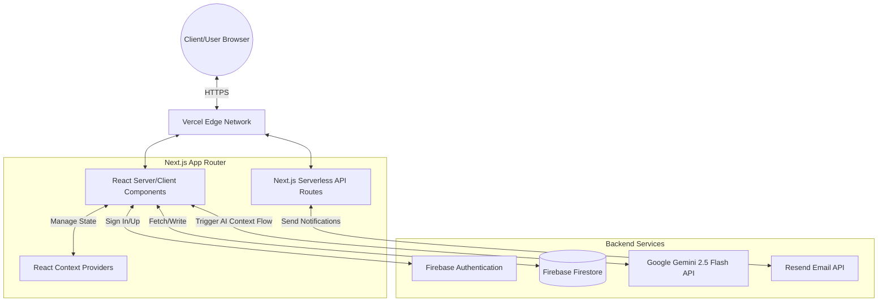
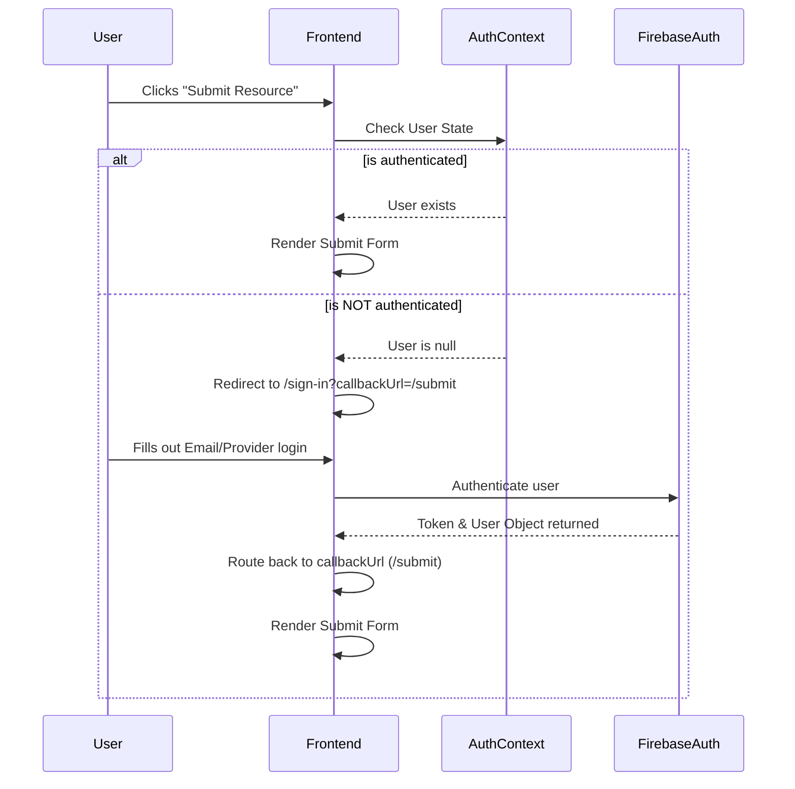
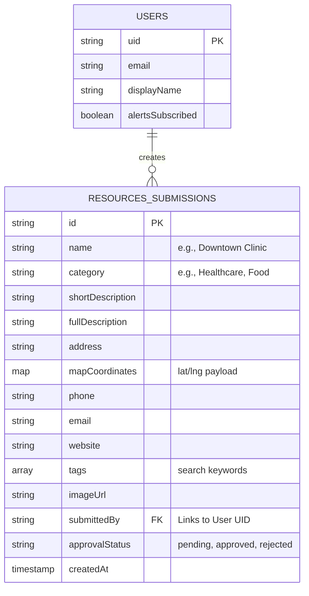

# 🌊 Port Laken Web

Welcome to the **Port Laken Website**. Port Laken is a fictional city (inspired by Port Angeles, WA) built strictly for educational and demonstration purposes.

This project serves as an **AI-powered civic portal** that demonstrates high-end web development, robust architecture, and complex user flows using modern tools like Next.js App Router, Firebase, and Gemini AI. 

---

## 🏗 High-Level Architecturee

The Port Laken web application is highly modular. It utilizes the **Next.js 14 App Router** for Server-Side Rendering (SSR) and seamless client navigation, while relying on **Firebase** for backend services (Auth/Database), and the **Google Gemini API** for intelligent data aggregation.



---

## 🗺 Detailed Page Breakdown & Functionality

The application is structured into a variety of interconnected, domain-specific modules. Below is a deep dive into how each key page functions.

### 1. **Home Page (`app/page.tsx`)**
The landing page serves as the entry point for the user, focusing heavily on aesthetics and immediate utility. 
- **Tech Used**: Framer Motion for scroll-reveals and SVG path drawing, native Next.js `<Image>` optimizations, and custom CSS for infinite-scrolling awards carousels.
- **Implementation Details**: Uses a `WeightedScrollProvider` to track scroll velocity and create parallax effects. The Hero section uses an absolutely positioned slideshow with CSS transitions instead of a heavy slider library. Quick Links automatically detect the global `AuthContext` to either route correctly to protected pages or redirect to `/sign-in`.

### 2. **Resource Directory (`app/resource-directory/page.tsx`)**
This is the flagship page of the app. It lists civic resources (healthcare, food, emergencies) in a responsive masonry grid structure.
- **Dual Data Source**: On mount, it aggregates a hardcoded initial array (`RESOURCES`) with live, community-submitted items pulled from the `resources` Firestore collection (filtered by `approvalStatus == 'approved'`).
- **AI Feature**: Integrates Google Gemini directly. When a user queries, it sends a payload of local page metadata and matching `resources` arrays to answer community-specific questions contextually.

### 3. **Submit a Resource (`app/resource-directory/submit/page.tsx`)**
A controlled, multi-step form built for residents to suggest new resources.
- **Flow**: Submits a payload to Firestore with `approvalStatus: "pending"`.
- **Validation**: Enforces standard rules (coordinates must be somewhat geographical, phone numbers in standard US format).

### 4. **Authentication & Profile (`app/sign-in` & `app/create-account`)**
Handles the onboarding of residents to manage preferences like emergency alerts.
- **Provider**: Firebase Authentication.
- **Flow**: Uses a query parameter `callbackUrl` so users clicking a protected action (like "Submit Resource" or "View Alerts") are pushed to sign in, then automatically returned to where they left off.

### 5. **Maps & Transport (`app/maps-transport/page.tsx`)**
Interactive geographic tools.
- **Tech Used**: `Leaflet.js` and `react-leaflet`. Next.js requires these maps to be dynamically imported with `ssr: false` since Leaflet relies on the `window` object which doesn't exist on the server. Features hardcoded bus routes and custom SVG markers.

### 6. **Alerts & Notification System (`app/alerts/page.tsx`)**
A system for managing user preferences for city announcements.
- **Flow**: Users subscribe to alerts. The system writes an updated array of notification preferences to the user's specific Firestore document under a `users` collection.
- **Email Migration**: We migrated from Mailjet to **Resend** to handle the outbound dispatch of transactional emails when these alerts actually trigger.

---

## 🔐 Authentication Redirect Flow

To ensure a seamless User Experience, any protected route redirects to `/sign-in` with a trace, allowing them to jump back gracefully upon auth resolution.



---

## 🧠 AI Overview Architecture (Gemini 2.5 Flash)

The "AI Overview" functionality on the Resource Directory is designed not to hallucinate. It is heavily context-bound using RAG (Retrieval-Augmented Generation) concepts without needing a dedicated vector database, since the dataset is relatively small.

### How we constrain the AI:
1. **Context Aggregation**: A function `buildAiContext` runs locally. It takes the user's search query, grabs a giant map of `PAGE_CONTEXTS` (pre-written summaries of everywhere in the app), and dumps in the JSON properties of all currently filtered civic resources.
2. **Prompt Injection**: The AI is told implicitly: *"You are the guide. Answer using ONLY the JSON below."*
3. **Structured Output**: We prompt the Gemini API to format its return payload as a JSON object requiring exactly: 
   - `text` (The 3-4 sentence answer).
   - `pageContextKey` (Which page router should it link out to?).
   - `address` (Null unless a specific map location was mentioned).

```mermaid
graph TD
    UserQuery[User types query: "Where can I get food?"] --> SearchComponent
    
    SearchComponent --> ContextBuilder{Context Builder}
    
    ContextBuilder --> |Pulls Static Data| PageMetadata[PAGE_CONTEXTS]
    ContextBuilder --> |Pulls Dynamic Data| FirestoreResources[(Firestore 'resources' collection)]
    
    ContextBuilder --> |Generates Master Prompt| GeminiAPI[Google Gemini 2.5 API]
    
    GeminiAPI --> |Returns strictly formatted JSON| JSONParser
    
    JSONParser --> |If Parsing Fails| RegexFallback[Regex Substring Fallback]
    JSONParser --> |If Valid| AIComponent[AIOverview.tsx]
    
    RegexFallback --> AIComponent
    
    AIComponent --> |Renders Summary string| UserView[UI Result Box]
    AIComponent --> |Renders Image Carousel| UIGraphics[Relevant Page Images]
```

---

## 🗄 Database Schema Details

We utilize a NoSQL structure within Firebase Firestore. Our most active collection is `resources`, housing all directories. 



### Record Approval Flow:
To prevent spam on the civic portal, any resource inserted by a client starts with an `approvalStatus` of `"pending"`. It is completely invisible on the directory page. Administrators change this flag to `"approved"`, which immediately populates it in the `Resource Directory` module and injects it into the Gemini AI `PAGE_CONTEXTS` memory tree.

---

> **Design Philosophy**: Port Laken prioritizes visual excellence and dynamic CSS over static utility, using a cohesive style system matching vibrant UI componenhkjmb ts with complex transitions. It acts as both a visual portfolio piece and a technical playground for combining robust architecture with experimental APIs.
